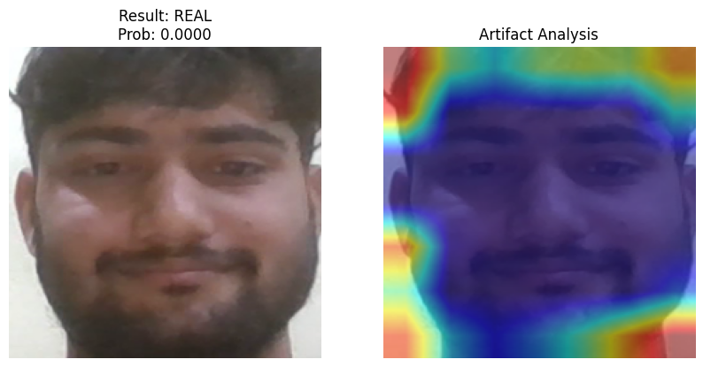
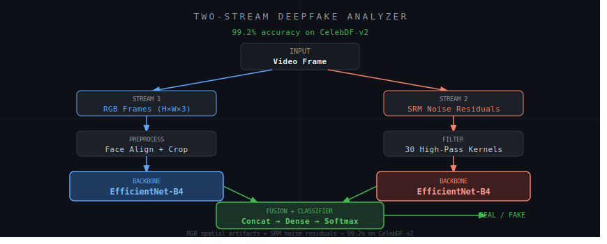

# Two-Stream Deepfake Analyzer


> **99.2% accuracy on CelebDF-v2** — a two-stream deep learning architecture that detects AI-generated deepfake videos by fusing RGB spatial features with SRM noise residuals through dual EfficientNet encoders.





---

## How it works

Deepfakes leave two types of traces — visual inconsistencies visible in RGB space, and subtle noise patterns only detectable in the frequency/residual domain. This model captures **both simultaneously** using two parallel EfficientNet-B4 streams:

- **RGB Stream** — processes raw video frames to detect visual artifacts: unnatural skin texture, inconsistent lighting, blending boundaries around the face
- **SRM Stream** — applies Spatial Rich Model high-pass filters to extract noise residuals, exposing manipulation traces that are completely invisible to the human eye

The feature maps from both streams are concatenated and passed through a fusion classifier that outputs a real/fake probability per video.

---

## Results

| Dataset | Accuracy | Notes |
|---------|----------|-------|
| **CelebDF-v2** | **99.2%** | High-quality celebrity deepfakes |

**CelebDF-v2** is one of the most challenging benchmarks in deepfake detection — containing 5,639 high-quality deepfake videos synthesized with state-of-the-art face swap methods. Most published models achieve 73–90% AUC on this dataset. A 99.2% accuracy demonstrates strong generalization on a hard, real-world distribution.

---

## Architecture



```
Input Video
     │
     ▼
Face Detection + Extraction (OpenCV / MTCNN)
     │
     ├─────────────────────┬──────────────────────────┐
     │                     │                          │
     ▼                     ▼                          │
 RGB Frames           SRM Filtering                   │
 (H x W x 3)     (30 SRM kernels applied)             │
     │                     │                          │
     ▼                     ▼                          │
EfficientNet-B4      EfficientNet-B4                  │
 (RGB Stream)        (SRM Stream)                     │
     │                     │                          │
     ▼                     ▼                          │
 Feature Map         Feature Map                      │
     │                     │                          │
     └──────── Concat ─────┘                          │
                  │                                   │
                  ▼                                   │
          Fusion Classifier                           │
          (Dense + Dropout)                           │
                  │                                   │
                  ▼                                   │
           Real / Fake (0/1)  ◄─────────────────────┘
```

### Why SRM?
Spatial Rich Model filters are borrowed from image steganalysis — they suppress image content and amplify subtle manipulation noise. When a GAN generates a face, the noise residual pattern differs from a real photograph. SRM captures exactly this difference, making it highly effective for detecting GAN-based deepfakes even when the RGB stream is fooled.

### Why EfficientNet-B4?
EfficientNet scales depth, width, and resolution uniformly — giving strong feature extraction at a fraction of the parameters of ResNet or Inception. B4 was chosen as the optimal point on the accuracy/compute tradeoff for video frame processing.

---

## Dataset

**CelebDF-v2** — Large-scale challenging deepfake detection benchmark
- 590 real videos + 5,639 deepfake videos of celebrities
- Synthesized using state-of-the-art GAN-based face swap methods
- Significantly harder than FaceForensics++ due to higher video quality
- Download: https://github.com/yuezunli/celeb-deepfakeforensics

---

## Project structure

```
two-stream-deepfake-analyzer/
├── backend/
│   ├── rgb_stream.ipynb        # RGB EfficientNet stream training
│   ├── srm_stream.ipynb        # SRM filter + EfficientNet stream
│   ├── fusion.ipynb            # Feature fusion and final classifier
│   └── inference.ipynb         # Run predictions on new videos
├── requirements.txt
└── README.md
```

---

## Setup & Usage

```bash
# Clone the repo
git clone https://github.com/lukkydiwan/two-stream-deepfake-analyzer.git
cd two-stream-deepfake-analyzer

# Install dependencies
pip install -r requirements.txt

# Run notebooks in order:
# 1. srm_stream.ipynb   — train SRM stream
# 2. rgb_stream.ipynb   — train RGB stream
# 3. fusion.ipynb       — fuse and train final classifier
# 4. inference.ipynb    — run on new videos
```

---

## Tech stack

| Library | Purpose |
|---------|---------|
| TensorFlow / Keras | Model training and EfficientNet backbone |
| OpenCV | Face detection, frame extraction, preprocessing |
| NumPy | SRM kernel convolution and array operations |
| Pandas | Dataset management and split handling |
| Matplotlib | Training curves, confusion matrix, results |
| Scikit-learn | Metrics — accuracy, AUC, precision, recall |

---

## Key references

- Li et al. — *Celeb-DF: A Large-scale Challenging Dataset for DeepFake Forensics*, CVPR 2020
- Fridrich & Kodovsky — *Rich Models for Steganalysis of Digital Images*, IEEE Trans. 2012 (SRM filters)
- Tan & Le — *EfficientNet: Rethinking Model Scaling for CNNs*, ICML 2019
- Zhou et al. — *Two-Stream Neural Networks for Tampered Face Detection*, CVPR Workshop 2019

---

## Author

**Lakshya Singh** · [LinkedIn](https://linkedin.com/in/lakshya-singh-243510302) · [GitHub](https://github.com/lukkydiwan)